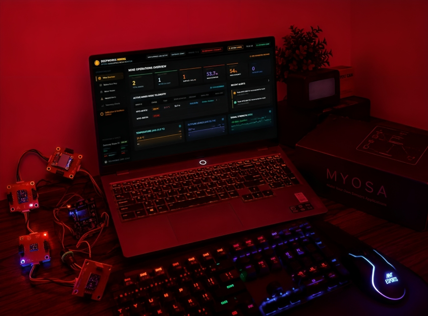
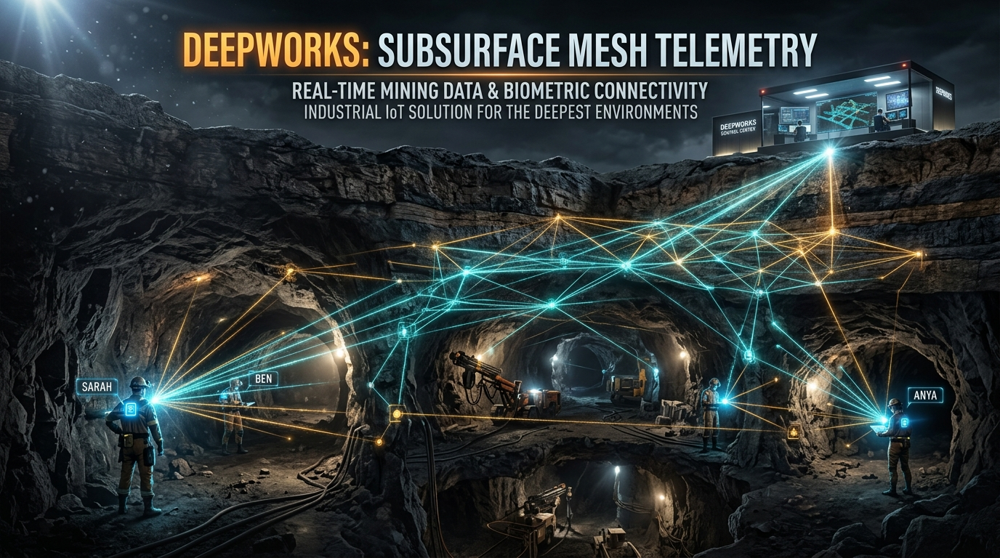
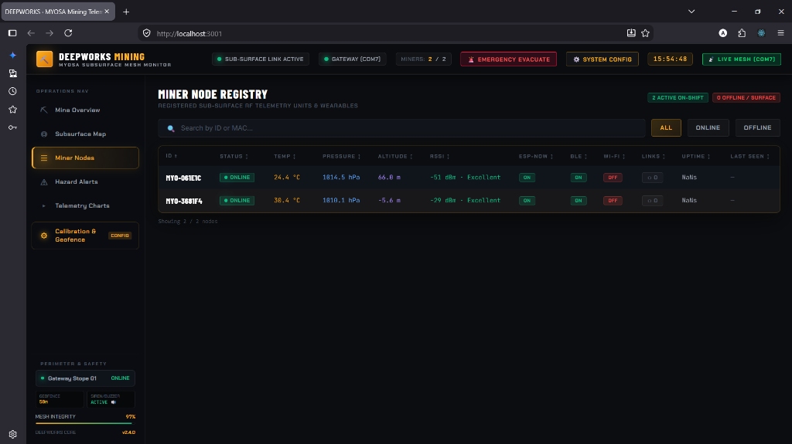
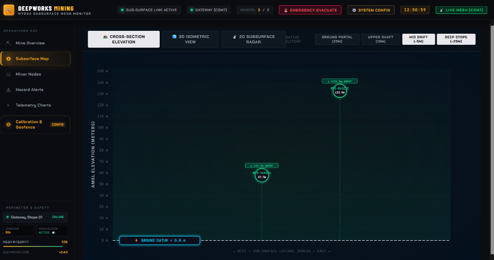
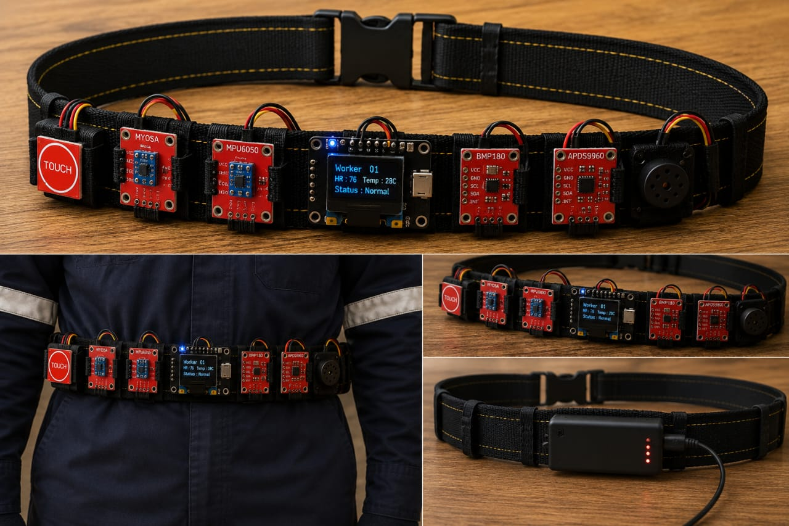
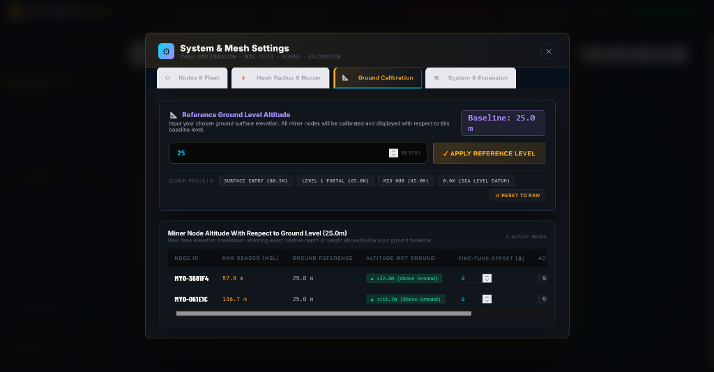

---
**PublishDate:** 2026-08-25 <br>
**Title:** "DeepWorks: Resilient Sub-surface Mining Telemetry & Miner Safety Mesh Network"<br>
**Excerpt:** "An industrial-grade, GPS-denied subsurface IoT mesh network and live tactical telemetry monitoring system built on MYOSA ESP32 wearable nodes, a secondary ESP32 mesh emulation relay node, an ESP32-S3 central coordinator gateway, and an interactive real-time command dashboard."<br>
**Image:**<br/>
<br>
**Tags:**
- ESP32
- MYOSA
- ESP-NOW
- BLE
- IoT
- MiningSafety
- Hardware
- WebSockets
- React
- SubsurfaceTelemetry
- MeshNetwork
---

> Resilient GPS-denied subsurface telemetry, multi-sensor atmospheric & miner hazard monitoring, multi-node mesh relay emulation, and instant bidirectional evacuation dispatch powered by the MYOSA ESP32 ecosystem.

---

## Acknowledgements

We express our deepest gratitude to the **MYOSA Platform Team**, the **ESP32 & Arduino Open-Source Community**, and underground mining safety engineers whose rigorous communication guidelines in hazardous environments inspired the fail-safe architecture of DeepWorks. We also thank the creators of FreeRTOS, SQLite, and the React ecosystem for enabling high-reliability embedded and web software development.

---

## Overview

Underground mining tunnels, deep stope excavations, and subterranean infrastructure represent some of the most unforgiving working environments on the planet. Deep rock strata, solid mineral seams, and confined geometries cause severe RF attenuation and multi-path distortion, rendering conventional consumer technologies—such as satellite GPS, 4G/5G cellular networks, and traditional standard Wi-Fi—completely inoperable. 

When catastrophic events occur—such as toxic gas accumulation, sudden roof collapses, seismic rockbursts, or individual medical emergencies—central surface operators face a critical information blackout. Without continuous telemetry, rescue teams cannot ascertain where trapped personnel are located, what environmental conditions they face, or whether evacuation orders have reached them.

**DeepWorks** is an end-to-end industrial IoT hardware and software monitoring ecosystem engineered specifically for subterranean and GPS-denied mining shafts. Powered by the **MYOSA ESP32 Multi-Sensor Wearable Badge**, a **Secondary ESP32 Sub-surface Node (used for active mesh relay and multi-point tunnel emulation)**, and a dedicated **ESP32-S3 Zero Gateway**, DeepWorks forms an autonomous, self-healing peer-to-peer 2.4 GHz RF mesh network that operates with zero dependency on external telecommunication infrastructure or cloud connectivity.

The system continuously captures, fuses, and relays environmental, spatial, and worker kinematic telemetry from every subterranean worker directly to a tactical surface command console at sub-second intervals.

**Key features:**
* **Multi-Node ESP32 Mesh & Relay Network:** True peer-to-peer RF mesh architecture featuring physical wearable units, secondary sub-surface relay/emulation nodes, and central gateway coordinators.
* **Custom Multi-Hop Layer-2 Mesh Protocol:** Custom multi-hop routing, sequence tracking, and deduplication protocol built directly on top of the connectionless ESP-NOW 2.4 GHz physical layer with sub-second transmission intervals.
* **Dual-Radio BLE & ESP-NOW Proximity Ranging:** Low-power Bluetooth Low Energy (BLE) beaconing and passive scanning combined with ESP-NOW RSSI for micro-proximity worker detection and spatial clustering.
* **Conditional Wi-Fi Activation with Anti-Flap State Machine:** Heavy Wi-Fi station mode remains dormant during underground mesh operation to eliminate IP stack power draw and RF interference, powering on automatically via a debounced state machine only when reaching the surface portal for high-bandwidth telemetry sync.
* **GPS-Denied Relative Positioning Engine:** 3D coordinate estimation combining multi-point RF Signal Strength (RSSI) log-distance path loss modeling across multiple nodes with atmospheric barometric relative depth calculations.
* **Atmospheric & Worker Safety Suite:** Real-time environmental and worker kinematic monitoring utilizing on-board BMP180 barometric pressure, MPU6050 6-axis IMU (motion, orientation, and immobility/man-down detection), and APDS9960 optical proximity/luminescence sensors.
* **Autonomous Entrapment & Collapse Detection Heuristic:** On-device probabilistic safety heuristic that flags structural entrapment when optical occlusion, total darkness, and sudden barometric air compression coincide.
* **Bidirectional Emergency Evacuation Dispatch:** 1-click surface broadcast that triggers synchronized 95dB sirens, tactile vibration, and full-contrast flashing OLED evacuation directives on all miner badges.
* **Smart Surface Elevation Auto-Silence:** Intelligent datum awareness that automatically silences badges with a `SURFACE SAFE` status once a miner ascends above the ground elevation baseline.
* **Continuous Admin Disconnect Safety Sentinel:** Real-time mesh watchdog in the surface command center that sounds continuous audible alarms if any miner node drops off the network, equipped with 1-click mute and auto-clearing upon reconnection.
* **Tactical Command Dashboard:** High-frequency React 18 & WebSockets dashboard featuring 2.5D spatial tunnel maps, elevation cross-sections, miner health metrics, and historical telemetry logging via SQLite.

---

## Demo / Examples

### Images

<p align="center">
<br/>
<i>DeepWorks Subsurface Mesh Network: Multi-Node Telemetry Relay across Deep Mining Tunnels to the Surface Control Center</i>
</p>

<p align="center">
<br/>
<i>DeepWorks Industrial Miner Wearable Badge based on MYOSA ESP32 with OLED Display, Multi-Sensor Suite, and Capacitive Safety Touch</i>
</p>

<p align="center">
<br/>
<i>DeepWorks Central Surface Command Center — Live Miner Node Registry, Real-time Sensor Metrics, and Dynamic Link Health</i>
</p>

<p align="center">
<br/>
<i>Real-time 2.5D Subsurface Tunnel Network Map & GPS-Denied Relative Spatial Positioning Grid</i>
</p>

<p align="center">
<br/>
<i>MYOSA Wearable Node Hardware Architecture: ESP32 Core, BMP180 Barometer, MPU6050 IMU, APDS9960 Optical Sensor, and HW-763 Touch Controller</i>
</p>

<p align="center">
<br/>
<i>Real-time Sub-surface Telemetry Charts: Atmospheric Pressure, Depth Profile, Kinematic Acceleration, and RF Link Quality</i>
</p>

### Videos
<p>
<video src="local.mp4" type="video/mp4" controls width="100%">
</video>
<i>Working of Dashboard</i>
</p>
<p>
</video>
<p>
<video src="presentation.mp4" type="video/mp4" controls width="100%">
</video>
<i>Working of Prototype</i>
</p>
<p>
</video>
<video src="extra.mp4" type="video/mp4" controls width="100%">
</video>
<i>Myosa OLED Display</i>
</p>
---

## Features (Detailed)

### **1. Multi-Node Hardware Topology & Secondary Node Mesh Emulation**
To rigorously validate multi-hop mesh routing, peer-to-peer neighbor discovery, and spatial trilateration in real hardware before underground field deployment, DeepWorks utilizes a three-tier hardware topology:
* **Node 1 (`MYO-3681F4` / COM10): Primary Wearable Miner Badge:**
  * Fully equipped hardware unit featuring the complete sensory payload (BMP180 barometer, MPU6050 6-axis IMU, APDS9960 optical proximity/lux, SSD1306 OLED display, HW-763 capacitive touch input, and active 95dB siren).
  * Continuously samples live environmental telemetry, handles worker interaction, and provides real-time on-badge evacuation alerts.
* **Node 2 (`MYO-061E1C`): Secondary ESP32 Sub-surface Node (Relay & Emulation):**
  * Operates as an active peer in the sub-surface RF mesh network.
  * Emulates a miner situated deeper inside a lower extraction stope or acting as a relay repeater along an underground gallery.
  * Transmits dynamic barometric pressure differentials, kinematic vibration samples, and RF telemetry packets over ESP-NOW, enabling real-time verification of multi-node mesh links, neighbor tables, and spatial separation algorithms.
* **Gateway Coordinator (`GATEWAY-COM7`): Waveshare ESP32-S3 Zero:**
  * Located at the mine portal or surface shaft entrance.
  * Acts as the promiscuous mesh listener and coordinator, validating packet CRC-8 checksums, extracting telemetry payloads, and piping real-time data over high-speed USB-CDC serial (115200 baud) directly to the central Node.js server.

### **2. Sub-surface RF Mesh Protocol Architecture & Packet Framing**
Underground mine tunnels suffer from intense signal scattering and metallic multipath interference. DeepWorks bypasses the overhead and fragility of standard TCP/IP networking by building a custom multi-hop relay and routing protocol directly on top of connectionless **ESP-NOW Layer 2 (802.11 Action Frames)**.
* **Packed Binary Envelope Structure:** Telemetry data is serialized into packed binary envelopes (`MyosaPacket`) with a fixed 17-byte header comprising:
  * `magic` (2 bytes, `0x4D59` identifier)
  * `senderMac` (6 bytes, originating hardware MAC)
  * `packetType` (1 byte, Heartbeat / Sensor / Alert / ConfigSync)
  * `timestamp` (4 bytes, on-device millisecond counter)
  * `sequence` (2 bytes, rolling counter to eliminate duplicate relayed frames)
  * `hopCount` (1 byte, TTL hop limiter for multi-hop mesh propagation)
  * `payloadLen` (1 byte, dynamic payload size)
  * `payload[]` (variable data struct)
  * `crc8` (1 byte trailing checksum)
* **Hardware-Accelerated CRC-8 Validation:** Every packet is validated with an optimized CRC-8 polynomial (`0x31`) calculated over the entire header and payload to discard corrupted frames caused by rock mass RF attenuation.
* **Calibrated Log-Distance Path Loss Model:** Relative spatial positioning is estimated using a calibrated log-distance propagation model:
  $$d = 10^{\frac{A - \text{RSSI}}{10 \cdot n}}$$
  where $A$ represents the measured 1-meter reference path loss and $n$ represents the tunnel attenuation exponent, combined with continuous differential barometric depth to map miners in 3D without GPS.

### **3. Dual-Radio BLE Beaconing & Conditional Wi-Fi Architecture**
DeepWorks leverages the ESP32 dual-radio architecture strategically for energy conservation and interference management:
* **Bluetooth Low Energy (BLE) Subsystem:**
  * **Identity Advertising:** The wearable badge advertises a standard non-connectable BLE beacon broadcasting its node identifier (`MYOSA-AABBCC`).
  * **Short-Range Proximity Ranging:** A low-duty-cycle passive BLE scanner periodically listens for adjacent miner badges within close range (~1–10m).
  * **Sensor Fusion:** `ProximityManager` fuses BLE RSSI with ESP-NOW signal metrics to refine near-field worker proximity and prevent subterranean vehicle-pedestrian collisions.
* **Conditional Wi-Fi & Anti-Flap State Machine:**
  * Standard high-power Wi-Fi station/AP mode is kept strictly **OFF** during normal underground mesh operations. This conserves battery power and ensures the 2.4 GHz spectrum remains dedicated to low-latency ESP-NOW frames.
  * **Anti-Flap Activation:** When a miner surfaces at the portal zone or an authorized gateway command triggers maintenance, a debounced finite state machine (`IDLE` -> `PENDING_ACTIVATION` -> `ACTIVE`) powers on the Wi-Fi radio to offload high-volume historical logs or perform Over-The-Air (OTA) firmware updates. Wi-Fi automatically powers down once the miner re-enters the mesh.

### **4. Multi-Sensor Environmental & Worker Kinematic Safety Suite**
Each MYOSA wearable badge functions as an autonomous safety sentry, polling an array of on-board I2C sensors at 10 Hz:
* **Barometric Pressure & Depth (BMP180 @ 0x77):** High-precision barometric sensing (300–1100 hPa with 0.02 hPa resolution) tracks depth relative to the calibrated surface datum.
* **Kinematics & Fall / Immobility Detection (MPU6050 @ 0x69/0x68):** A 3-axis accelerometer ($\pm 2g$) and 3-axis gyroscope ($\pm 250^\circ/\text{s}$) with complementary digital filtering identify slips, sudden high-G impacts, and worker immobility (man-down condition).
* **Optical Proximity & Ambient Luminescence (APDS9960 @ 0x39):** Measures ambient illumination levels and infrared optical reflection to verify headlamp operation and close-range obstruction.
* **Self-Healing I2C Reconnection:** If transient electrical noise or mechanical vibration briefly glitches the I2C bus, firmware auto-recovery reinitializes the sensor drivers within 2 seconds without requiring a device reset.

### **5. Autonomous Entrapment & Structural Collapse Heuristic**
In sudden rockburst or tunnel cave-in scenarios, trapped miners may be rendered unconscious and unable to activate emergency beacons. DeepWorks executes a multi-sensor probabilistic entrapment heuristic directly in firmware:
* **Coincident Multi-Sensor Thresholding:** Evaluates three simultaneous physical signatures:
  1. Optical occlusion (`proximity > 180`) indicating physical debris covering the chest badge.
  2. Complete darkness (`ambientLight < 5 lux`) indicating subterranean burial.
  3. Rapid barometric pressure surge ($\Delta P > 0.8\text{ hPa}$) caused by air compression during sudden rockfall displacement.
* **Debounced Alert Dispatch:** When all three conditions persist for 3 consecutive evaluation cycles, the badge automatically broadcasts an emergency `CRITICAL_ALERT (BURIED_MINER)` packet across the mesh to alert surface rescue crews with the victim's last known coordinates.

### **6. Bidirectional Emergency Evacuation Siren & 1-Click Dispatch**
Emergency response time is the single most critical factor in underground survival:
* **Surface Control Room Trigger:** With a single click of the `EMERGENCY EVACUATE` button on the web console, the surface gateway floods the RF mesh with high-priority `ALERT (EVACUATION)` and `CONFIG_SYNC (evacuateActive = 1)` downlinks.
* **Badge Siren & OLED Inversion:** Wearable badges immediately lock into an emergency state: the SSD1306 OLED display flashes in high-contrast inverted video displaying **`EVACUATE NOW - ASCEND TO SURFACE`**, accompanied by a 95dB active buzzer alarm.
* **Capacitive Touch Acknowledgment:** Miners can tap the badge's capacitive touch sensor (`HW-763` on `GPIO13`) to acknowledge receipt and silence the sound locally while remaining in evacuation route mode.
* **Smart Surface Elevation Auto-Silence:** The firmware continuously monitors altitude relative to the surface ground datum. When the miner reaches safe ground level (`altitude >= groundDatum - 0.5m`), the badge automatically silences the alarm and displays **`SURFACE SAFE`**.

### **7. Continuous Admin Disconnect Safety Sentinel**
To prevent miners from silently disappearing from network visibility:
* **Gateway Watchdog:** The central gateway maintains a 12-second timeout window per node. If no telemetry or heartbeat packet is received within 12 seconds, the node status transitions to `OFFLINE`.
* **Industrial Acoustic Warning:** The web dashboard immediately triggers a continuous dual-tone audio alarm pulse via the Web Audio API to alert dispatch operators.
* **Prominent Header Banner & 1-Click Mute:** A flashing red banner (`🚨 1 NODE OFFLINE!`) appears on the navigation bar with a dedicated `🔕 MUTE ALARM` button.
* **Auto-Clearing on Reconnect:** As soon as the missing node re-establishes RF mesh contact, the alert is automatically cleared, the audio alarm terminates, and the dashboard transitions back to normal green operating status.

### **8. Atmospheric Baseline & Sub-surface Depth Calibration Engine**
Because weather changes shift barometric pressure across seasons and days, DeepWorks incorporates dynamic atmospheric calibration:
* **Ground Level Datum Sync:** Operators can specify the known elevation datum (e.g. 50.0m AMSL) or bind the baseline to a reference node located at the tunnel portal.
* **Over-The-Air Broadcast:** The gateway broadcasts the updated datum across the RF mesh via `SET_DATUM:XX.X`, ensuring all wearable nodes compute consistent, true subsurface depth values.

---

## Usage Instructions

### **Hardware Pinout & Multi-Node Setup Specifications**

| Node Role | Hardware Model | Port / Address | Key Functions |
| :--- | :--- | :--- | :--- |
| **Node 1: Wearable Miner Badge** | MYOSA ESP32-WROOM-32 | `COM10` (I2C 0x77, 0x69, 0x39, GPIO13, GPIO25) | Full sensor payload, OLED display, touch ACK, 95dB siren, BLE beaconing |
| **Node 2: Mesh Relay & Emulation Node** | ESP32-WROOM-32 | Multi-Node Mesh Peer | Subsurface stope telemetry relay, peer link testing, ESP-NOW routing |
| **Gateway: Surface Mesh Coordinator** | Waveshare ESP32-S3 Zero | `COM7` (USB-CDC 115200 baud) | RF mesh aggregation, downlink dispatch, JSON serial bridge |

### **Compiling & Flashing Firmware via Arduino CLI**

```bash
# 1. Flash the Gateway Coordinator (ESP32-S3 Zero on COM7)
arduino-cli compile --fqbn esp32:esp32:waveshare_esp32_s3_zero firmware/gateway_node
arduino-cli upload --fqbn esp32:esp32:waveshare_esp32_s3_zero --port COM7 firmware/gateway_node

# 2. Flash the Wearable Miner Badge (MYOSA ESP32 on COM10)
# (Put ESP32 into Boot Mode: Hold BOOT + Tap RESET)
arduino-cli compile --fqbn esp32:esp32:esp32:PartitionScheme=huge_app firmware/wearable_node
arduino-cli upload --fqbn esp32:esp32:esp32:PartitionScheme=huge_app --port COM10 firmware/wearable_node
```

### **Launching the Surface Command Center**

```bash
# 1. Install dependencies
cd backend && npm install
cd ../frontend && npm install

# 2. Build Frontend Production Assets
cd ../frontend && npm run build

# 3. Launch Backend Gateway & Web Server
cd ../backend && node server.js
```

### **Accessing the Console**
Open any modern web browser and navigate to:
```plaintext
http://localhost:3001
```

* **1-Click Launch on Windows:** Double-click `DeepWorks.bat` in the repository root directory to launch the backend, build the frontend, and open the command center automatically.

---

## Tech Stack

* **Embedded Hardware:**
  * **Primary Wearable Unit:** MYOSA ESP32-WROOM-32 Development Board (Dual-core 240MHz, 520KB SRAM, 4MB Flash)
  * **Secondary Mesh Node:** ESP32-WROOM-32 (Sub-surface mesh relay & multi-miner emulation)
  * **Gateway Coordinator:** Waveshare ESP32-S3 Zero (Dual-core 240MHz, 2MB PSRAM, USB-CDC)
* **Embedded Firmware:**
  * **Platform:** C++ / Arduino ESP32 Core v3.x
  * **OS / Scheduling:** FreeRTOS dual-core task scheduling
  * **Wireless Networking:** Custom Multi-Hop Mesh Protocol over ESP-NOW 2.4 GHz & BLE Beaconing
  * **Drivers:** Adafruit BMP085/BMP180, Direct Register APDS9960 & MPU6050 I2C Drivers, U8g2 / Adafruit SSD1306
* **Surface Gateway Backend:**
  * **Runtime:** Node.js v20+ / Express
  * **Serial Engine:** `serialport` & `@serialport/parser-readline` (115200 baud)
  * **Real-time WebSockets:** `ws` v8.x
  * **Database Engine:** `better-sqlite3` (WAL mode enabled)
* **Tactical Command Dashboard:**
  * **Framework:** React 18, Vite 5
  * **Audio Synthesis:** Web Audio API Acoustic Siren Synthesizer
  * **Visualization:** HTML5 Canvas 2.5D Subsurface Mesh Renderer, Chart.js

---

## Requirements / Installation

### **Software Prerequisites**
* Node.js v18.0.0 or higher
* npm v9.0.0 or higher
* Arduino CLI or Arduino IDE 2.x with `esp32:esp32` board package (v3.0.0+)
* Modern browser (Google Chrome, Microsoft Edge, Mozilla Firefox)

### **Installation Commands**

```bash
# Clone the repository
git clone https://github.com/your-username/myosa-subsurface-monitor.git
cd myosa-subsurface-monitor

# Install backend dependencies
cd backend && npm install

# Install frontend dependencies and compile UI bundle
cd ../frontend && npm run build

# Return to root and launch
cd ..
node backend/server.js
```

---
```
## File Structure
techtrons01-myosa/deepworksubterrainnian-mines-mesh
│
├── assets/
│   ├── images/
│   │   └── myosa_subsurface_monitor/
│   │       ├── cover-image.jpg
│   │       ├── deepworks-cover-banner.jpg
│   │       ├── deepworks-dashboard-live.png
│   │       ├── deepworks-logo.jpg
│   │       ├── hazard-monitoring-charts.png
│   │       ├── myosa-wearable-hardware.jpg
│   │       └── subsurface-mesh-map.png
│   │
│   └── video/
│       └── myosa-subsurface-monitor-demo.mp4
├── backend/
│   ├── alertManager.js
│   ├── db.js
│   ├── healthMonitor.js
│   ├── meshTopology.js
│   ├── package.json
│   ├── routes/
│   │   └── api.js
│   ├── serialGateway.js
│   └── server.js
│
├── firmware/
│   ├── gateway_node/
│   │   └── 3_GatewayNode.ino
│   │
│   └── wearable_node/
│       ├── 1_ScanNearbyWiFi.ino
│       ├── alert_manager.cpp
│       ├── alert_manager.h
│       ├── config.h
│       ├── display_manager.cpp
│       ├── display_manager.h
│       ├── locator_mode.cpp
│       ├── locator_mode.h
│       ├── mesh_manager.cpp
│       ├── mesh_manager.h
│       ├── sensor_manager.cpp
│       ├── sensor_manager.h
│       ├── system_manager.cpp
│       ├── system_manager.h
│       ├── telemetry_manager.cpp
│       ├── telemetry_manager.h
│       └── types.h
│
├── frontend/
│   ├── src/
│   │   ├── components/
│   │   │   ├── AlertPanel.jsx
│   │   │   ├── ChartPanel.jsx
│   │   │   ├── Dashboard.jsx
│   │   │   ├── LinkedNodesModal.jsx
│   │   │   ├── NetworkMap.jsx
│   │   │   ├── NodeDetail.jsx
│   │   │   ├── NodeTable.jsx
│   │   │   ├── SettingsModal.jsx
│   │   │   ├── Sidebar.jsx
│   │   │   └── StatusBadge.jsx
│   │   │
│   │   ├── hooks/
│   │   │   └── useWebSocket.js
│   │   │
│   │   ├── utils/
│   │   │   ├── audioAlert.js
│   │   │   └── formatters.js
│   │   │
│   │   ├── App.jsx
│   │   ├── index.css
│   │   └── main.jsx
│   │
│   ├── index.html
│   ├── package.json
│   └── vite.config.js
│
├── .gitignore
├── DeepWorks.bat
├── DeepWorks_Dev.bat
├── Launch_DeepWorks.vbs
├── README.md
├── cover-image.jpg
├── deepworks-cover-banner.jpg
├── deepworks-dashboard-live.png
├── deepworks-logo.jpg
├── deepworksubterranean-mines-mesh.md
├── extra.mp4
├── hazard-monitoring-charts.png
├── local.mp4
├── myosa-wearable-hardware.jpg
├── package.json
├── presentation.mp4
└── subsurface-mesh-map.pngtechtrons01-myosa/
│
├── assets/
│   └── ... (old assets retained for README/reference)
│
├── backend/
│   ├── alertManager.js
│   ├── db.js
│   ├── healthMonitor.js
│   ├── meshTopology.js
│   ├── package.json
│   ├── routes/
│   │   └── api.js
│   ├── serialGateway.js
│   └── server.js
│
├── firmware/
│   ├── gateway_node/
│   │   └── 3_GatewayNode.ino
│   │
│   └── wearable_node/
│       ├── 1_ScanNearbyWiFi.ino
│       ├── alert_manager.cpp
│       ├── alert_manager.h
│       ├── config.h
│       ├── display_manager.cpp
│       ├── display_manager.h
│       ├── locator_mode.cpp
│       ├── locator_mode.h
│       ├── mesh_manager.cpp
│       ├── mesh_manager.h
│       ├── sensor_manager.cpp
│       ├── sensor_manager.h
│       ├── system_manager.cpp
│       ├── system_manager.h
│       ├── telemetry_manager.cpp
│       ├── telemetry_manager.h
│       └── types.h
│
├── frontend/
│   ├── src/
│   │   ├── components/
│   │   │   ├── AlertPanel.jsx
│   │   │   ├── ChartPanel.jsx
│   │   │   ├── Dashboard.jsx
│   │   │   ├── LinkedNodesModal.jsx
│   │   │   ├── NetworkMap.jsx
│   │   │   ├── NodeDetail.jsx
│   │   │   ├── NodeTable.jsx
│   │   │   ├── SettingsModal.jsx
│   │   │   ├── Sidebar.jsx
│   │   │   └── StatusBadge.jsx
│   │   │
│   │   ├── hooks/
│   │   │   └── useWebSocket.js
│   │   │
│   │   ├── utils/
│   │   │   ├── audioAlert.js
│   │   │   └── formatters.js
│   │   │
│   │   ├── App.jsx
│   │   ├── index.css
│   │   └── main.jsx
│   │
│   ├── index.html
│   ├── package.json
│   └── vite.config.js
│
├── .gitignore
├── DeepWorks.bat
├── DeepWorks_Dev.bat
├── Launch_DeepWorks.vbs
├── README.md
├── cover-image.jpg
├── deepworks-cover-banner.jpg
├── deepworks-dashboard-live.png
├── deepworks-logo.jpg
├── deepworksubterranean-mines-mesh.md
├── extra.mp4
├── hazard-monitoring-charts.png
├── local.mp4
├── myosa-wearable-hardware.jpg
├── package.json
├── presentation.mp4
└── subsurface-mesh-map.png
```
---

